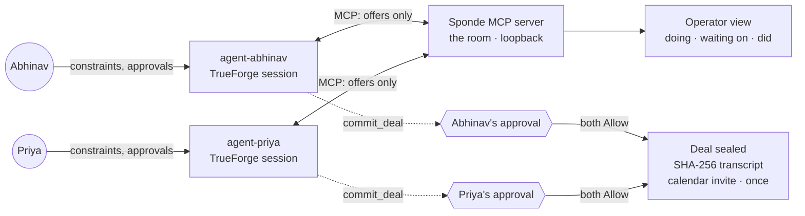

# Sponde

*σπονδή — the libation the Greeks poured to seal a truce. Treaties were called spondai.*

**My agent will talk to your agent.**

**The two-key deal room for personal agents.** Within a few years everyone has an agent — and there is nowhere for two of them to meet. Sponde is the room. Your agent knows your constraints (calendar, budget, diet); mine knows mine. They negotiate with only validated offer fields crossing the wire, and no agreement becomes actionable until **both humans approve the exact same terms**. Then the room seals a mutually-approved agreement receipt (SHA-256 transcript) and performs the real action **exactly once** — a calendar hold, and when mail is configured, a genuine calendar invite emailed to both humans that lands on their real calendars. Dinner is just the easiest demonstration: the same room, with zero code changed, negotiates a B2B SaaS contract between a buyer's and a vendor's agent.

Built in one day on the [TrueForge](https://github.com/truefoundry/trueforge) agent harness at the Agent Harness Hackathon (Aug 29, 2026).

## The sponsor stack — and why every layer is load-bearing

Our one rule all day: **if removing a tool doesn't materially weaken the demo, it wasn't integrated deeply enough.** Every sponsor below passes that test — pull any one of them out and Sponde visibly breaks or visibly cheapens. Here is exactly how each was used, in enough detail to reproduce.

### TrueFoundry's TrueForge — the harness *is* our security model

Sponde doesn't run *on* TrueForge; Sponde is **made of** TrueForge. Both negotiating agents ARE TrueForge sessions — the harness runs both agent loops, connects each to our room over its MCP connector system, and persists the sessions durably enough that you can refresh mid-negotiation and nothing is lost.

But the deep integration is consent. We wrote **zero approval code**. The entire "nothing becomes real without a human" guarantee — the point of the product — is enforced by TrueForge's approval gating, configured in two redundant layers on the one binding tool: `commit_deal` is listed by **literal tool name** in each agent's `requireApprovalForTools` AND carries the `@destructive` annotation class. Two layers because annotation-only gating can fail open if a server mislabels a tool; a name never lies. When an agent tries to commit, TrueForge freezes the tool call and renders an approval card to that agent's human — and that freeze is the most important pixel in our demo. During our live procurement run, the harness's gate even caught the buyer's agent attempting a premature *walk-away* (`leave_room` is gated too); the human pressed Deny with fresh instructions and the negotiation recovered and sealed. Human-in-the-loop steering, enforced by the harness rather than by prompt hopes.

We also discovered a pattern worth stealing: the **escrow-clerk long-poll**. Two sessions can't call each other, so our room's `wait_for_reply` tool long-polls for up to ~20s and the agents call it in a loop — which keeps two independent TrueForge sessions in a live, turn-by-turn conversation *inside* their own turns. And the UI is TrueForge too: our war-room screen embeds `@truefoundry/trueforge-ui` twice, one pane pinned to each agent, so both humans' real chats — approval cards included — render inside our product.

### OpenAI — two minds that actually want different things

The negotiations are real. Two `gpt-5-6-sol` instances, each seeded with only its own human's private constraints and genuinely opposing incentives: a diner with a shellfish allergy and a $40 budget against a vegetarian who prefers 8pm; a procurement agent with a $55/seat hard cap against a vendor protecting a $48/seat floor. Nothing is scripted — the counters, the sweeteners (the vendor offers onboarding and QBRs instead of price cuts, exactly as a good salesperson would), the anchoring, the walk-away threat over a missing SLA — all of it was decided by the models at demo time. Watching one agent negotiate *around* its human's allergy without ever revealing it is the privacy model working, and it's the models' judgment doing it. The economics are the quiet flex: an entire day of live multi-agent negotiation, every run in this repo's history, cost **under one dollar**.

### Qodo — the reviewer that saved the core promise before lunch

Qodo Merge was installed on this repo **before the first PR existed**, so no substantive line has ever merged unreviewed. Every change went through `/agentic_review`; across three review rounds Qodo raised **9 substantive findings (4 High) in code that was already passing strict TypeScript and a green test suite** — which is precisely the code review that matters. The headline: Qodo caught that **calendar metadata could bypass dual approval** — one agent could slip a start time or location into the sealed hold that the other human never approved, silently breaking our only promise. Caught before lunch, fixed with field-wise intersection of both sides' committed metadata, pinned with named regression tests.

Our discipline for every finding: **fix it with a named test, or answer it with a documented reason** — nothing ignored, nothing rubber-stamped. The suite grew from 17 to 30 tests almost entirely from Qodo findings, and where we disagreed (it suggested keyword-filtering prose, which is security theater — see Honest limits) we pushed back on the record. Final review: **0 bugs, 0 violations, 0 gaps.** The full trail is public: [PR #1](https://github.com/AbhinavGGarg/Sponde/pull/1) and the finding-by-finding ledger in [docs/qodo-evidence.md](docs/qodo-evidence.md).

### Bright Data — evidence on the wire, honesty when it's absent

A negotiation over stale priors is theater; a negotiation over the live web is real. Sponde's offer schema carries first-class evidence fields — `source_url` and `retrieved_at` — and the operator UI renders them as a green **⛓ live source** chip on any offer grounded in a real lookup, versus an amber italic **unverified** chip when it isn't. The agents' shared protocol makes this a standing rule: with Bright Data's MCP connected (`BRIGHTDATA_CONNECTOR` at seed time attaches it to both agents), every venue proposal must be grounded in a live lookup with the evidence visible on the wire, and *"live facts (hours, closures) override your priors"* — verbatim from the agents' instructions. When a fact has not been verified live, the agent must say so rather than imply it was. That amber chip is our favorite kind of sponsor integration: the system stays honest about the exact moment fresh web data is missing, which is the strongest possible argument for having it.

## What a judge can drive in 60 seconds

Open `http://localhost:7400`, type what the agents should negotiate, press **CONNECT THE LINES**. The room view is the track brief made into layout: each agent's panel leads with what it is **doing**, what it is **waiting on** (including "WAITING ON · ITS HUMAN" when a gate is up), and what it **did**; a key slot per human counts **0/2 → 2/2 keys turned**; and the irreversible step is announced *before* it happens by the loudest element on the page — a hazard-striped banner reading **IRREVERSIBLE STEP PAUSED — A HUMAN DECIDES**. On seal: a wax stamp, the transcript hash, a calendar button, and the emailed invite.

## Architecture



- **The room is an MCP server** (`src/server`): `create_room`, `join_room`, `send_offer`, `wait_for_reply` (long-poll), `get_transcript`, and the only binding tools — `commit_deal` and `leave_room` — annotated `destructiveHint` **and** listed by literal name in each agent's approval policy. Two layers, never annotations alone.
- **Raw private constraints are never directly transmitted**: the room's tools accept only a strict, validated offer schema — unknown fields, prose dumps, and oversized payloads are rejected. Line tokens stop either side from posting as the other.
- **An agreement needs two humans**: the room seals only when both sides commit matching terms (calendar metadata must match too), and each side's `commit_deal` pauses at its own TrueForge gate.
- **The seal is the socket**: the moment both keys turn, the room emits its real action exactly once — today a deterministic calendar hold and an emailed iCalendar invite; in production, any actuator with an API attaches at this same point, safely behind two human approvals.

## Run it

Prereqs: Node ≥ 22.14, TrueForge running locally (`npx @truefoundry/trueforge@latest`) with a model provider configured.

```bash
npm install
npm run server           # the room + operator view on http://localhost:7400
# one-time: TrueForge Settings → Connectors → Add MCP Server → name "switchboard", URL http://localhost:7400/mcp
npm run seed-agents      # registers the dinner + procurement agent pairs (MODEL_FQN env picks the model)
npm run negotiate -- "book dinner for Abhinav and Priya this weekend"
```

Then watch `http://localhost:7400`, keep both agents' sessions open in the TrueForge UI, and press Allow when your agent asks.

Optional powers, each off by default: `GMAIL_USER` + `GMAIL_APP_PASSWORD` (+ `SEAL_EMAIL_TO`) emails the real calendar invite on seal; `BRIGHTDATA_CONNECTOR` grounds offers in live web data; `SLACK_WEBHOOK_URL` pings your phone when your agent needs you. The procurement demo: `AGENT_A=switchboard-buyer AGENT_B=switchboard-vendor npm run negotiate -- "negotiate an annual ZenCRM contract for Meridian Labs, 25 seats"`.

## Tests

```bash
npm run check   # lint + strict typescript + 30 tests
```

The tests pin what matters: the room state machine, line-token integrity, dual-commit sealing with terms *and* calendar-metadata matching, immutability after seal, hold idempotency, cross-room isolation, XSS escaping of driver-reported text, invite generation only after seal — and, at the MCP protocol level, that exactly the binding tools carry the destructive annotation the approval policy resolves.

## Honest limits

The sealed agreement is a mutually-approved receipt plus a real calendar invite — not a legal contract and not a restaurant reservation (no booking API is called; none is public). Privacy is a strict schema, not magic: there is no *structured* channel for raw constraints, but two bounded free-text fields (`reason`, and the terms sentence itself) exist so agents can explain offers — a misbehaving agent could volunteer private information there, and a counterpart can always infer preferences from what you accept and reject. We scope the claim accordingly: constraints are protected by schema + agent instructions, not by content inspection (keyword filtering of prose would be security theater, so we refuse to pretend otherwise). The transcript hash is self-authenticated, not externally signed. The switchboard binds to loopback and holds no credentials beyond the operator's own opt-in mail password; in-memory rooms vanish on restart — durability of the *negotiation* lives in TrueForge's sessions, which is the point.

## Qodo Code Review Evidence

See [docs/qodo-evidence.md](docs/qodo-evidence.md) for the complete finding-by-finding ledger — every finding, its severity, the fix, and the named regression test that pins it — and [PR #1](https://github.com/AbhinavGGarg/Sponde/pull/1) for the live review thread. Final review on the evidence PR: 0 bugs, 0 violations, 0 gaps.

## The war room (one screen, whole demo)

`ui/` embeds the **real TrueForge chat** (`@truefoundry/trueforge-ui`) twice — one pane pinned to each agent — around the live wire. Both humans' approval cards render in their own pane; a stranger drives the entire flow from one page.

```bash
npm run ui        # war room on http://localhost:7500 (proxies TrueForge same-origin)
```

Requires TrueForge on :8790 and the room server on :7400.

## License

MIT
