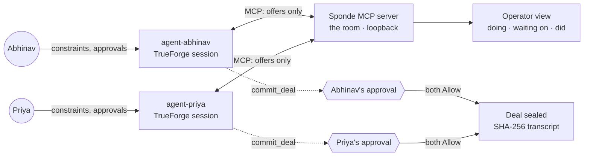

# Sponde

*σπονδή — the libation the Greeks poured to seal a truce. Treaties were called spondai.*

**My agent will talk to your agent.**

**The two-key deal room for personal agents.** Within a few years everyone has an agent — and there is nowhere for two of them to meet. Sponde is the room. Your agent knows your constraints (calendar, budget, diet); mine knows mine. They negotiate with only validated offer fields crossing the wire, and no agreement becomes actionable until **both humans approve the exact same terms**. Then the room seals a mutually-approved agreement receipt (SHA-256 transcript) and issues the real action — a calendar hold — exactly once. Dinner is just the easiest demonstration.

Built in one day on the [TrueForge](https://github.com/truefoundry/trueforge) agent harness at the Agent Harness Hackathon (Aug 29, 2026).

## What a judge can drive in 60 seconds

Open `http://localhost:7400`, type what the agents should negotiate, press **CONNECT THE LINES**. The operator view then shows, live: what each agent is **doing**, what it is **waiting on** (including "waiting on its human" when an approval gate is up), and what it **did** (every offer on the wire, then the sealed receipt). The irreversible step — `commit_deal` — is asked about *before* it happens, never after: a hazard-striped banner marks the pause while TrueForge holds the tool call for the human.

## Architecture



- **The room is an MCP server** (`src/server`): `create_room`, `join_room`, `send_offer`, `wait_for_reply` (long-poll, so both agents converse live inside their turns), `get_transcript`, and the only binding tools — `commit_deal` and `leave_room` — annotated `destructiveHint` **and** listed by literal name in each agent's `require_approval_for_tools`. Two layers, never annotations alone.
- **Raw private constraints are never directly transmitted**: each agent holds its human's constraints in its own instructions, and the room's tools accept only a strict, validated offer schema — unknown fields, prose dumps, and oversized payloads are rejected. (Offers and rejections can still *indirectly* reveal preferences; see Honest limits.) Line tokens stop either side from posting as the other.
- **An agreement needs two humans**: the room seals only when both sides commit matching terms, and each side's `commit_deal` is paused by its own TrueForge approval gate. Nothing on the switchboard can make one human's click cover the other.
- **The harness does the work**: two TrueForge sessions run the agent loops, MCP connects them to the room, approvals gate commitment, and sessions survive a refresh mid-negotiation. The driver (`src/scripts/negotiate.ts`) only starts turns and reports display-state; it never negotiates or approves.
- **Live web data** (optional): connect Bright Data's MCP in TrueForge and set `BRIGHTDATA_CONNECTOR` — the agents then negotiate over fresh, real venue data instead of priors.

## Run it

Prereqs: Node ≥ 22.14, TrueForge running locally (`npx @truefoundry/trueforge@latest`) with a model provider configured.

```bash
npm install
npm run server           # the room + operator view on http://localhost:7400
# one-time: TrueForge Settings → Connectors → Add MCP Server → name "switchboard", URL http://localhost:7400/mcp
npm run seed-agents      # registers agent-abhinav + agent-priya (MODEL_FQN env to pick the model)
npm run negotiate -- "book dinner for Abhinav and Priya this weekend"
```

Then watch `http://localhost:7400`, keep both agents' sessions open in the TrueForge UI, and press Allow when your agent asks. `SLACK_WEBHOOK_URL` (optional) sends the "your agent needs you" pings to your phone.

## Tests

```bash
npm run check   # lint + strict typescript + 12 tests
```

The tests pin what matters: the room state machine, line-token integrity, dual-commit sealing with terms matching, immutability after seal, and — at the MCP protocol level — that exactly the binding tools carry the destructive annotation the approval policy resolves.

## Honest limits

The sealed agreement is a mutually-approved receipt plus a calendar hold — not a legal contract and not a restaurant reservation (no booking API is called). Privacy is a strict schema, not magic: there is no *structured* channel for raw constraints, but two bounded free-text fields (`reason`, and the terms sentence itself) exist so agents can explain offers — a misbehaving or misinstructed agent could volunteer private information there, and a counterpart can always infer preferences from what you accept and reject. We scope the claim accordingly: constraints are protected by schema + agent instructions, not by content inspection (keyword filtering of prose would be security theater, so we refuse to pretend otherwise). The transcript hash is self-authenticated, not externally signed. The switchboard binds to loopback and holds no credentials; in-memory rooms vanish on restart — durability of the *negotiation* lives in TrueForge's sessions, which is the point.

## The integration rule

Every tool in this project must pass one test: **if removing it doesn't materially weaken the demo, it wasn't integrated deeply enough.** TrueForge runs the loops and holds the gates; OpenAI's models do the actual bargaining; the room enforces privacy and dual consent; Bright Data's live data changes what gets proposed (offers carry `source_url` + `retrieved_at` on the wire); and Qodo is deliberately a build-time layer — every substantive PR reviewed before merge, never dressed up as a runtime ingredient.

## License

MIT

## The war room (one screen, whole demo)

`ui/` embeds the **real TrueForge chat** (`@truefoundry/trueforge-ui`) twice — one pane pinned to each agent — around the live wire. Both humans' approval cards render in their own pane; a stranger drives the entire flow from one page.

```bash
npm run ui        # war room on http://localhost:7500 (proxies TrueForge same-origin)
```

Requires TrueForge on :8790 and the room server on :7400. If a pane layout misbehaves, swap `layout="widget"` for `"dock"` in `ui/src/App.tsx` — and the two-browser-windows setup from the runbook remains the zero-risk fallback.
